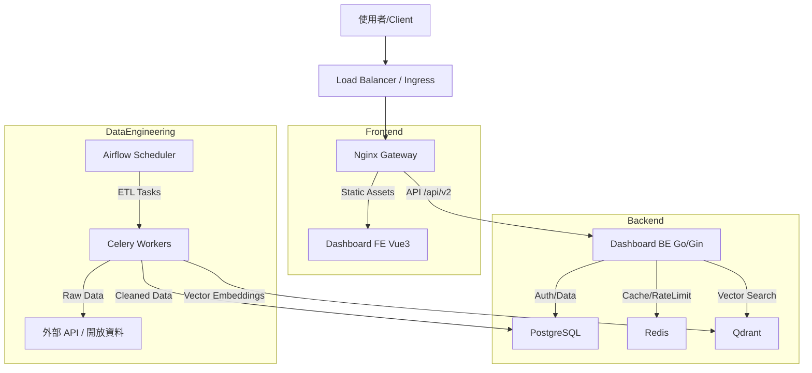

# 台北城市儀表板 (Taipei City Dashboard) 系統說明文件

> **版本**: 2.2.0
> **更新日期**: 2026-02-12
> **維護者**: Taipei Urban Intelligence Center (TUIC)

## 1. 系統總覽 (System Overview)

台北城市儀表板是一個整合性的資料視覺化平台，旨在協助台北市政府進行政策決策，並向市民提供透明的城市數據。系統採用現代化的全端微服務架構，整合了後端 API、前端互動介面、以及強大的資料工程管線。

### 1.1 技術堆疊 (Tech Stack)

| 領域 | 技術組件 | 說明 |
| --- | --- | --- |
| **Backend** | **Go** (Golang) 1.23+ | 高效能 API 服務，使用 **Gin** 框架 |
| | **PostgreSQL** 15 | 主要關聯式資料庫 (Relational Data) |
| | **Redis** | 快取與 Rate Limiting |
| | **Qdrant** | 向量資料庫 (Vector DB)，用於 RAG 與語義檢索 |
| **Frontend** | **Vue 3** | 前端核心框架 |
| | **Vite** | 建置工具 |
| | **Pinia** | 狀態管理 (State Management) |
| | **Mapbox GL JS** / **Deck.gl** | 3D 地圖與空間資料視覺化 |
| **Data Eng** | **Apache Airflow** | ETL 排程與管線管理 |
| | **Python** | 數據處理腳本 |
| **DevOps** | **Docker** & **Docker Compose** | 容器化部署 |
| | **Helm** | Kubernetes (K8s) 部署管理 |

### 1.2 系統架構圖 (System Architecture)



---

## 2. 後端架構詳解 (Backend Architecture)

後端位於 `Taipei-City-Dashboard-BE` 目錄，採用 **Go** 語言與 **Gin** Web Framework 開發。設計遵循 MVC 模式與 Clean Architecture 原則。

### 2.1 目錄結構

- `app/controllers`: 處理 HTTP 請求的邏輯 (Handler Functions)。
- `app/models`: 資料庫結構體 (Structs) 與 GORM 定義。
- `app/routes`: 路由定義 (`router.go`)，負責將 URL 對應至 Controller。
- `app/middleware`: 中介軟體 (JWT 驗證, Rate Limiting, CORS)。
- `app/services` (若有): 複雜業務邏輯層。
- `global`: 全域變數與配置 (Config, DB 連線實例)。

### 2.2 核心模組

#### 認證與授權 (Auth & User)
- **JWT (JSON Web Token)**: 用於 API 請求的身分驗證。
- **TaipeiPass (台北通)**: 整合 OAuth2 登入，允許市府員工與市民登入。
- **Middleware**: `ValidateJWT`, `IsLoggedIn`, `IsSysAdm` 確保路由安全。

#### 儀表板與組件 (Dashboard & Component)
- **Dashboard**: 定義儀表板的佈局 (Layout) 與包含的組件。
    - 類型: `Personal` (個人), `Public` (公開), `Department` (局處)。
- **Component**: 最小視覺化單位（如：折線圖、地圖圖層）。
    - 屬性包含: `Type` (Chart/Map), `DataSource`, `Config` (視覺設定)。

#### 智慧功能 (Smart Features)
- **Chatlog (LLM)**: 紀錄與大型語言模型的對話，支援自然語言查詢儀表板數據。
- **Vector (RAG)**: 使用 Qdrant 儲存組件的向量嵌入 (Embeddings)，支援語義搜尋 ("找一下跟交通有關的圖表")。

### 2.3 資料庫模型 (Models)
主要模型定義於 `app/models/`：
- `User`: 使用者帳戶與權限。
- `Dashboard`: 儀表板 metadata。
- `ComponentConfig`: 組件的視覺化設定 (JSONB in Postgres)。
- `ComponentData`: 實際數值資料 (通常經由 ETL 寫入)。

---

## 3. 前端架構詳解 (Frontend Architecture)

前端位於 `Taipei-City-Dashboard-FE` 目錄，基於 **Vue 3** 生態系建構。

### 3.1 核心技術
- **Build Tool**: Vite (快速熱重載與打包)。
- **Store**: Pinia (取代 Vuex)。
- **Router**: Vue Router (SPA 路由)。
- **Map**: Mapbox GL JS + Deck.gl (高效能地圖渲染)。

### 3.2 狀態管理 (Pinia Stores)
位於 `src/store/`：
- `authStore`: 管理 User Token, Login Status, Permission。
- `contentStore`: 管理 Dashboard 列表, Component 數據快取。
- `mapStore`: 管理地圖 Layer 的開關、透明度、互動狀態。
- `adminStore`: 後台管理介面的專用狀態。

### 3.3 路由結構 (Routes)
- `/dashboard`: 前台主頁，展示儀表板。
- `/mapview`: 全螢幕地圖探索模式。
- `/component/:id`: 單一組件詳細資訊頁。
- `/admin/*`: 後台管理區域 (需 Admin 權限)。
    - `/admin/user`: 使用者管理。
    - `/admin/dashboard`: 儀表板配置管理。
    - `/admin/issue`: 錯誤回報管理。

---

## 4. 資料工程詳解 (Data Engineering)

資料工程位於 `Taipei-City-Dashboard-DE` 目錄，核心為 **Apache Airflow**。

### 4.1 DAG 結構
DAG (Directed Acyclic Graph) 定義於 `dags/`，主要專案路徑為 `dags/proj_city_dashboard/`。

#### 命名規則
檔案命名通常反映了資料源或更新頻率：
- **D 開頭 (e.g., `D050302`)**: 通常代表 **Daily** (每日) 更新或批次任務。代碼可能對應內部的資料編號標準。
- **R 開頭 (e.g., `R0088`)**: 通常代表 **Realtime** (即時) 或高頻更新任務。
- **語義化名稱**: 如 `aed_locations` (AED 位置), `bike_path` (自行車道), `flu_hospitals_tpe` (流感疫苗合約院所)。

### 4.2 排程與分流 (Queue Strategy)
為了避免重型任務 (Heavy ETL) 阻塞即時任務 (Realtime Data)，系統採用了 Queue 分流策略：
- **Realtime Queue**: 處理 `*/5 * * * *` (每5分鐘) 等高頻任務。
- **Default/Heavy Queue**: 處理每日或每月的大量資料更新。
- **Worker**: Airflow Celery Workers 會針對不同 Queue 進行消費。

### 4.3 數據流 (Data Flow)
1. **Ingest**: 從 Open Data API (JSON/CSV) 或資料庫讀取原始資料。
2. **Transform**: 使用 Python (Pandas) 進行清洗、格式轉換、座標轉換 (TWD97 to WGS84)。
3. **Load**: 寫入 PostgreSQL (`component_data` table) 或更新 Qdrant 向量索引。

---

## 5. 部署與維運 (Deployment & DevOps)

### 5.1 Docker Compose (Local/Dev)
位於 `docker/` 目錄：
- `docker-compose.yaml`: 定義了完整的本地開發環境。
- **Services**:
    - `dashboard-fe`: Node.js 容器。
    - `dashboard-be`: Go 容器 (Hot Reload via Air or similar).
    - `nginx`: 反向代理，處理 SSL 與 API轉發。
    - `postgres-data`: 業務資料庫。
    - `redis`: 快取。
    - `qdrant`: 向量庫。

### 5.2 Helm Charts (K8s/Prod)
位於 `helm-chart/` 目錄：
- 支援多環境配置: `values-sit.yaml` (測試環境), `values-prod.yaml` (生產環境)。
- 依賴 (Dependencies): 定義於 `Chart.yaml`，包含 PostgreSQL HA 與 Redis HA (Bitnami Charts)。

### 5.3 常見指令

#### 啟動本地開發環境
```bash
cd docker
docker-compose up -d
```

#### 前端開發
```bash
cd Taipei-City-Dashboard-FE
npm install
npm run dev
```

#### 後端開發
```bash
cd Taipei-City-Dashboard-BE
go run main.go
```
